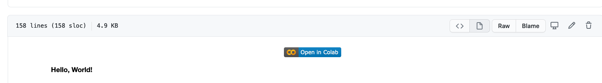
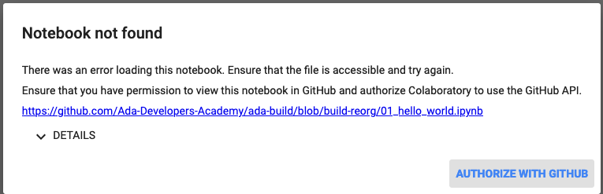

# Python Environment

_Ada Build - Intro to Python - Lesson 0_

# Learning Goals

* Learn to use Python in the [Google Colab] to complete Ada Build lessons.
* Understand how [repl.it](https://repl.it/) will be use.

## Video Intro

The [Introduction to Google Colab video](https://adaacademy.hosted.panopto.com/Panopto/Pages/Viewer.aspx?id=3fefdcce-9b07-4c0f-a5d6-ac020156a9c6) will serve as an introduction to the programming environment that you will use for the subsequent lessons. Please view this X minute video before continuing.

## Google Colab

For the Learning to Code portion of the Ada Build Curriculum you will review notes and complete exercises in a series of lessons in [Google Colab](./intro-to-python/00_preparing_to_code.ipynb). Colab is google's hosting of Jupyter Notebook, an open-source web application that allows you to create and share documents that contain live code, equations, visualizations and narrative text. Uses for Jupyter Notebook include: data cleaning and transformation, numerical simulation, statistical modeling, data visualization, machine learning, and much more. Here we are using colab and jupyter notebook to create an interative intro to python course.

Before you get started you will need two things:

1.  A [Github account](https://github.com/) to access the Notebooks as Colab will ask Github for access to the document.  It's free and something you will likely want to have as you continue this path to become a developer.
2.  A [Google Account](https://support.google.com/accounts/answer/27441?hl=en).  You will need this to run the Jupyter Notebooks in Google Colab.

When you first click on the link to a Colab Notebook you may be directed to a page like the one below. Make sure to choose "Open with Google Colaboratory".

Lets take a look at the [Preparing to code Notebook](../00_preparing_to_code.ipynb).

When you visit the notebooks in Github, you will want to click on **Open in Colab**.

Then select Authorize with Github

Lastly if you want to keep the notebook as your own you can make a copy into Google drive.

## Python REPL

Python provides an interactive computer program that allows the user to enter Python code and get results of that code immediately. It is a feature known as a REPL (read, evaluate, print loop). These kinds of programs are great for trying out new commands, practicing syntax, and evaluating solutions to small problems. It's one of the two primary ways to use Python to interact with a computer. The other is to put Python code into a file and then ask the computer to read and execute the code in the file. We will do lots of both.

We will provide solutions for some of the exercises in **Ada Build - Introduction to Programming in Python** in [repl.it](https://repl.it/).
