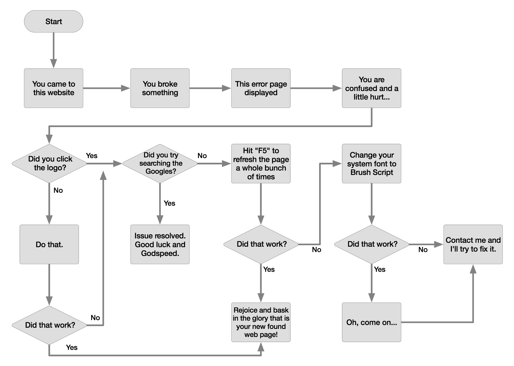

# Programming Expressions
_JumpStart: Lesson 10_

## Learning Goals
- Understand and be able to use relational operators
- Understand and be able to use truth tables for logical operators
- Understand and be able to use conditional statements
- Understand the control flow of a program

## Activities
* Review the [notes](#notes) in this section
* Complete the [practice problems](./practice-problems.md)
* Complete the next version of the [number's assignment](#numbers-problem-assignment)
* Complete the [candy machine assignment](#candy-machine-assignment)
* [Optional] For additional learning and practice, look at the lessons and exercises of [Day 2 of JumpStart Live](https://github.com/Ada-Developers-Academy/jump-start-live/tree/master/lessons/day2#lessons)

## Notes
### Relational operators
* Relational operators allow you to compare two values.
* Here is a list of different relational operators:

| __Operator__ | __Description__ | __Example__ | __Result__ |
| :--- | :--- | :--- | :--- |
| `==` | equals | `1 + 1 == 2` | `true` |
| `!=` | does not equal | `3.2 != 2.5` | `true` |
| `<` | less than | `10 < 5` | `false` |
| `>` | greater than | `10 > 5` | `true` |
| `<=` | less than or equal to | `126 <= 100` | `false` |
| `>=` | greater than or equal to | `5.0 >= 5.0` | `true` |

* In Ruby, you can use relational operators on all numbers and strings. Additionally you can use equals and does not equal on arrays and hashes. (Note: We'll learn more about *Arrays* and *Hashes* later in this curriculum.)
* The opposite of `>` (greater than) is `<=` (less than or equal to). Similarly, the opposite of `<` (less than) is `>=` (greater than or equal to).
* `=` is the assignment operator, which is very different than `==` which is the equality operator.
* The result of a relational operator is either `true` or `false`, also known as a boolean.

#### Boolean values
* The two possible values of a boolean data type are `true` and `false`
* A non-boolean value that evaluates to true, is called "truthy"
  * Everything in Ruby is "truthy" except for `nil`
* A non-boolean value that evaluates to false, is called "falsey", also sometimes "falsy"
  * `nil` is the only "falsey" value in Ruby

### Logical operators
Logical operators allow you to combine or modify boolean expressions.

| Operator | Description | Example | Result |
| :--- | :--- | :--- | :--- |
| `&&` | and | `(2 == 3) && (-1 < 5)` | `false` |
| `\|\|` | or | `(2 == 3) \|\| (-1 < 5)` | `true` |
| `!` | not | `!(2 == 3)` | `true` |

| p | q | p && q | p \|\| q |
| :--- | :--- | :--- | :--- |
| `true` | `true` | `true` | `true` |
| `true` | `false` | `false` | `true` |
| `false` | `true` | `false` | `true` |
| `false` | `false` | `false` | `false` |

| p | !p |
| :--- | :--- |
| `true` | `false` |
| `false` | `true` |


### Conditionals
Conditional statements allow your programs to take different paths based on different inputs. You have already seen some version of conditional statements if you have ever seen a flow diagram like the one below.

.

To create conditional statements use `if`, `elsif`, and `else` to control the flow of a program. It is important to property indent conditional statements. Indentation is not required for a program to execute, however, it is absolutely necessary to be able to correctly read your program.

#### Syntax
```ruby
if <boolean expression>
  # conditional body
  # this code only executes if the <boolean expression> evaluates as true
  # the conditional body is indented one more than the if and end statements
end
```

```ruby
if <boolean expression>
  # conditional body
  # the conditional body is indented one more than the if, else and end statements
else
  # else body
  # the else body is indented one more than the if, else and end statements
end
```


#### Examples
```ruby
test_score = gets.chomp.to_i

if test_score > 90
  print "You got an A!"
end
```

```ruby
test_score = gets.chomp.to_i

if test_score > 90
  print "You got an A!"
else
  print "You did not get an A!"
end
```

```ruby
puts "What is your favorite animal?"
fav_animal = gets.chomp

if fav_animal.downcase == "camel"
  puts "I also love camels!"
else
  puts "That's a great animal, but I love camels the most."
end

puts "Thanks for playing the favorite animal game!"
```

```ruby
puts "What is your favorite animal?"
fav_animal = gets.chomp.downcase

if fav_animal == "camel"
  puts "I also love camels!"
elsif fav_animal == "kangaroo"
  puts "The kangaroo is my second favorite animal!"
else
  puts "That's a great animal, but I love camels the most."
end

puts "Thanks for playing the favorite animal game!"
```

## Numbers problem assignment
* Throughout this course we will be working with the **Numbers program**. Here's the second version of the program:
  * Leveraging your learnings from the notes you read, write a program that does the following:
    *  Do the following three times:
      * Ask the user to input a positive integer value
      * If the number is greater than or equal to 20, display a message to share so and a different message otherwise.
    * Example output:
        * *Note*: User input is indicated in ~~ (tildes).

```
   This program will ask you to enter numbers and share if the number is less than 20.
   Enter the 1st number: ~34~
   34 is greater than or equal to 20.
   Enter the 2nd number: ~20~
   20 is greater than or equal to 20.
   Enter the 3rd number: ~12~
   12 is less than 20.
```

## Candy machine assignment

### Overview
This challenge is to build a computer candy machine. You’ve got some money and you want to buy some candy.  So, you go up to the candy machine, put in your money, select your candy, and then pick up your candy and your change. You can use `gets.chomp` to get input from the user without the extra newline at the end.

### Requirements
* Ask the user how much money they have, assume that thUser input is indicated in ~~ (tildes).e `$` symbol is part of the prompt (the user doesn't have to enter it)
* Display all candy options and their costs (even if the user cannot afford the candy)
* Decide whether the user can afford the candy or not, if they can't, tell them so, if they can, calculate and display their change
* [Optional] Handle when the buyer enters "C" or "c" so that it works as expected
* [Optional] Do something appropriate when the buyer enters an invalid amount for the money and an invalid selection

### Example output
```
Welcome to Ada Developers Academy's Computer Candy Machine!
(All candy provided is virtual.)

How much money do ya got? > $1.00

$1.00, that's all?
Well, lemme tell ya what we got here.

A $0.65 Twix
B $0.50 Chips
C $0.75 Nutter Butter
D $0.65 Peanut Butter Cup
E $0.55 Juicy Fruit Gum

So, What'll ya have? > C

Thanks for purchasing candy through us.
Please take your candy, and your $0.25 change!
```


```
Welcome to Ada Developers Academy’s Computer Candy Machine!
(All candy provided is virtual.)

How much money do ya got? > $0.50

$0.50, that's all?
Well, lemme tell ya what we got here.

A $0.65 Twix
B $0.50 Chips
C $0.75 Nutter Butter
D $0.65 Peanut Butter Cup
E $0.55 Juicy Fruit Gum

So, What'll ya have? > D

You're broke. Take your $0.50 and go elsewhere.
```
