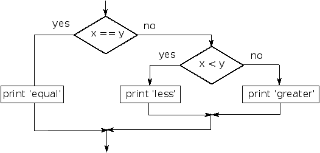

# Practice problems

_JumpStart: Lesson 10_

## Conditional practice

1. Use your new knowledge of conditionals to recreate this flow control diagram using conditionals in code.  
Assume that the `x` and `y` variable data comes from user input prior to the conditional execution. 



2. Now we will go the other way! Using the code below create the flow control diagram that would represent it.

      ```ruby
      number_of_sides = gets.chomp

      if number_of_sides == 1
        print "You've got a line"
      elsif number_of_sides == 2
        print "I'm not really sure what you have"
      elsif number_of_sides == 3
        print "You've got a triangle"
      elsif number_of_sides == 4
        print "You've got some sort of quadrilateral"
      end
      ```

3. Read the code in each section, draw a corresponding flow chart and then predict the output. Check your answers by running the code snippets in Terminal.

      ```ruby
      # problem 1
      cookies = true
      cake = false

      if cookies == true
         print "OMG COOKIEZ"
      end
      if cake == true
         print "OMG CAKE!"
      else
         print "WHATEVZ DESSERTZ."
      end

      # problem 2
      person_age = 55
      ada_age = 2

      if person_age < ada_age
         print "This person is younger"
      elsif ada_age < person_age
         print "Ada is younger"
      else
         print "They’re the same!"
      end

      # problem 3
      pet = "cat"
      food = "ice cream"

      if pet == "cat"
         print "here kitty"
      elsif pet == "dog"
         print "woof"
      else
         print "some other sound"
      end

      if food == "broccoli"
         print "eh."
      elsif food == "ice cream"
         print "yum"
      end

      # problem 4
      x = 7
      y = 7

      if x >= y
         if x > y
            print "x is bigger"
         else
            print "x = y"
         end
      else
         print "y is bigger"
      end

      # problem 5
      x = 7
      y = 7

      if x > y || x == y
         if x > y
            print "x is bigger"
         else
            print "x = y"
         end
      else
         print "y is bigger"
      end

      # problem 6
      x = 7
      y = 7

      if x >= y
         print "x is bigger"
      else
         print "y is bigger"
      end

      if x == y
         print "x = y"
      end
      ```
