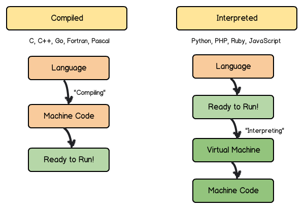
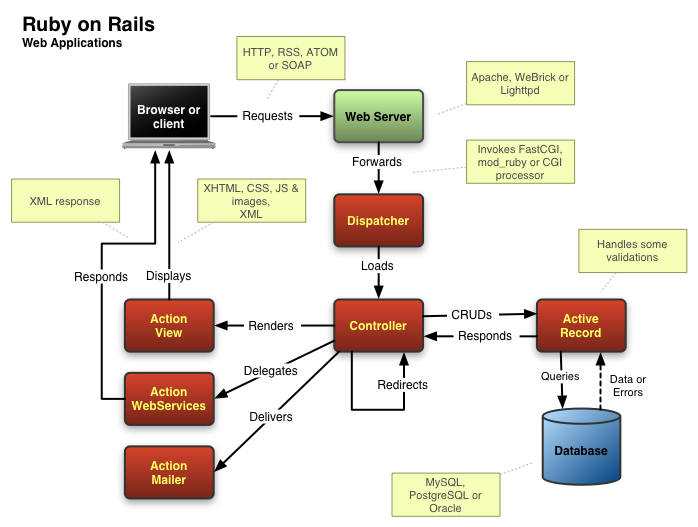

# Notes: The Big Picture
Throughout this Jumpstart program, you will learn a number of different topics about the Ruby programming language. In this lesson, we will discuss the different technologies that can be used along with Ruby and how those all play together in your journey in learning to program.

## Programming Languages
In a discussion about programming languages, a preliminary question that one might ask is, why are there so many programming languages?

The reason is that some languages are better at certain things than others. There might be one language that is easier to program in (i.e. Ruby) versus being more performant (i.e. C++). Other language tradeoffs may just be based off of being an old language versus a new language.

### Classifying Programming Languages
There are two main ways we can classify programming languages:
- By the level - which means how close the language is to being [binary code](https://en.wikipedia.org/wiki/Binary_code)
  - Low Level
    - i.e. C
    - More difficult to read than other languages
  - High Level
    - i.e. Java, Python and Ruby
    - More abstract
    - Contain more natural language elements
    - Do a lot more for the programmer

- By whether they are Compiled or Interpreted
  - Compiled languages are converted to binary code
    - i.e. C, C++, Lisp
  - Interpreted languages can be translated _or_ directly executed
    - i.e. Ruby, Python
    - The code does not get directly converted to binary, the program that runs the program is the one that communicates with the computer
      - This extra steps makes these languages slower

In Addition, these compiled and interpreted languages can be divided into **dynamically typed** and **statically typed** languages.

**Statically typed** programming languages do type checking (the process of verifying and enforcing the constraints of types) at _compile-time_ as opposed to _run-time_.

**Dynamically typed** programming languages do type checking at _run-time_ as opposed to _compile-time_. **Ruby is a dynamically typed language**.

### Ruby
Ruby is a programming language which was created to make developers have fun and be productive at the same time. As Ruby reads like English (compared to other programming languages), many would recommend learning Ruby as your first programming language.

### HTML & CSS
HTML (Hyper-Text Markup Language) is a [markup language](https://en.wikipedia.org/wiki/Markup_language). CSS (Cascading Style Sheets) is a [stylesheet language](https://en.wikipedia.org/wiki/Style_sheet_language). These two technologies work together for structuring and styling the content on a web page.

You can think of the HTML as the "skeleton" of a web page. The set up, and structure for how each piece is organized.

The CSS is the "clothes" of the skeleton. How each piece looks, colors, sizes, styles and relationship to other elements on the page.

### JavaScript
JavaScript is a dynamically typed and interpreted programming language. JavaScript is used along side HTML and CSS as one of the most important languages in web programming. In many applications, we use JavaScript to provide a more dynamic and responsive experience for the end user.

## Frameworks
According to wikipedia:
  > A software framework is a universal, reusable software environment that provides particular functionality as part of a larger software platform to facilitate development of software applications, products and solutions. Software frameworks may include support programs, compilers, code libraries, tool sets, and application programming interfaces (APIs) that bring together all the different components to enable development of a project or solution.

This is a lot of technical jargon, but basically it means that frameworks allow us to leverage the hard work of the programmers that came before us so that we can create software more quickly. [What is a Software Framework? And why should you like 'em?](http://info.cimetrix.com/blog/bid/22339/What-is-a-Software-Framework-And-why-should-you-like-em)

### Ruby on Rails
Ruby on Rails, or Rails for short, is a Model-View Controller (MVC) Framework which provides the default a database, a web service and web pages.

In English, Ruby on Rails allows you, as a developer, to create an entire web application without having to rely on someone else to create part of it for you. This is because the framework hides some things that you really don't need to know as a beginner.

