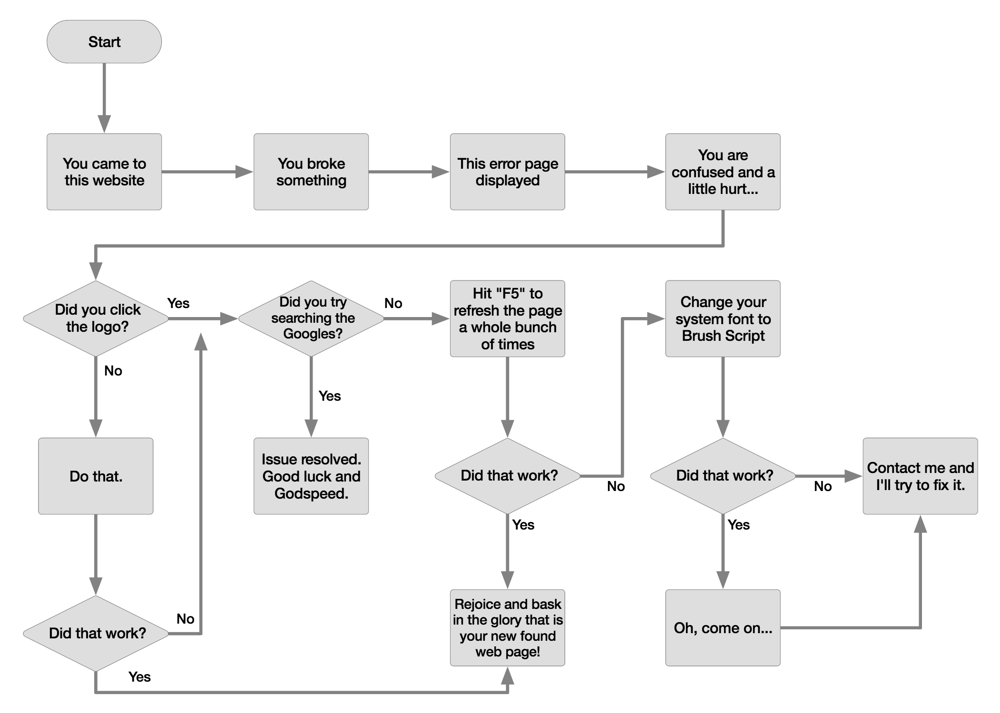

## Flow Control
The if statement, also known as a conditional statement, is the first types of branching you learn when programming. It allows you to specify a condition which will determine a branch of execution of code.

You have already seen some version of conditional statements if you have ever seen a flow diagram! Here is a good example:



### Conditionals
`if` and `else` allow you to control the flow of your program. This means that they allow you to define which lines of code will execute, and which will be skipped.

We will use our knowledge of operators to create the boolean expressions that our conditionals with use.

You can create a basic `if` statement using the syntax below.
```ruby
if <boolean expression>
  # then-statement code here
end
```

The Boolean statement, called a predicate, is evaluated, producing a `true` or `false` outcome.  
- If the outcome is `true`, the then-statement is performed
- If the outcome is `false`, the then-statement is skipped  
**Note**: You can assume that the `if` statement reads, "if the boolean expression is true then..." which is why we call this the then-statement.


Example:
```ruby
test_score = gets.chomp.to_i

if test_score > 90
  print "You got an A!"
end
```


If you want to execute code when the boolean expression is `false`, then you should use the `else`.
- If the outcome is `true`, the then-statements are executed and the else-statements are skipped
- If the outcome is `false`, the then-statements are skipped and the else-statements are executed

```ruby
if <boolean expression>
  # then-statement code here
else
  # else-statement code here
end
```

Example:
```ruby
test_score = gets.chomp.to_i

if test_score > 90
  print "You got an A!"
else
  print "You did not get an A!"
end
```
In the example above, what will happen for the following user input?
- 100
- 0
- -12
- "ada"

In the example below, note that the `puts` statement on the last line will execute no matter which conditional statements are executed.
```ruby
puts "What is your favorite animal?"
fav_animal = gets.chomp

if fav_animal.downcase == "camel"
  puts "I also love camels!"
else
  puts "That's a great animal, but I love camels the most."
end

puts "Thanks for playing the favorite animal game!"
```

### Note on Formatting
It is important to note that the formatting of these conditional statements is important to the understanding of the start and stop of each block of code. This is not critical to the execution of the code but is important to the readability of it.


### elsif
The `if/else/end` code we've written above is the standard and most basic form of a conditional.

We can expand upon this to include more boolean expressions that will control additional statement execution.

In a scenario where you need more than an "either/or", you should use `elsif`. `elsif` stands for "else if".

`elsif` is used with a different boolean expression that is used with the `if`.

We can see an example using `elsif` by extending the animal example from above to check for our second favorite animal:
```ruby
puts "What is your favorite animal?"
fav_animal = gets.chomp.downcase

if fav_animal == "camel"
  puts "I also love camels!"
elsif fav_animal == "kangaroo"
  puts "The kangaroo is my second favorite animal!"
else
  puts "That's a great animal, but I love camels the most."
end

puts "Thanks for playing the favorite animal game!"
```
