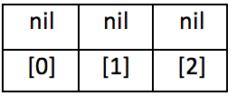

# Notes: Arrays
Arrays are the most common data type used to create collections in Ruby.

An `Array` is an _ordered_ collection of objects.

Array Example:
```ruby
[1, 10, 33, 50, 2, 7]
```

### Creating Arrays
There are two different ways to create a new Array.

#### Empty
In the first way, we initialize an empty `Array` by using `[]`. An array can be assigned to a variable like any other data type:

```ruby
my_array = []
```

We know that this array is empty because the array definition starts with the `[`(left bracket) and ends with the `]`(right bracket), and there is nothing between those two symbols.

The second way is to explicitly create a new instance of the `Array` object defined in the Ruby core library.

```ruby
my_array = Array.new
```

#### With Data
We can utilize the syntax for both of the above to initialize a new Array _with data_.

```ruby
numbers = [1, 2, 3, 4]
```


We can do something similar when creating an array using `Array.new`. When passing parameters into `new`, the first parameter will be the size of the desired array. The second parameter will be the default value for all element within the array.

```ruby
empty_array = Array.new(3)
empty_array # => [nil, nil, nil]
```


```ruby
default_array = Array.new(3, "def")
default_array # => ["def", "def", "def"]
```


### Indices
Arrays are integer-indexed starting at __zero__. All counting in computer science [begins with zero](http://skillcrush.com/2013/01/17/why-programmers-start-counting-at-zero/). This means that **each item** in the array corresponds to an **integer value**, and that integer is used to access an object within the `Array`. The first object is assigned 0 and increments up from there.

```ruby
numbers = [1, 10, 33, 50, 2, 7]
numbers[0] # => 1
numbers[1] # => 10
numbers[2] # => 33
numbers[3] # => 50
numbers[4] # => 2
numbers[5] # => 7
```


### Data Types
Arrays can store all sorts of data. Usually, it makes the most sense to have a single data type in an array, but in Ruby, it is not a requirement.

This means that arrays can store data types of `Integer`, `String`, and `Float`!

```ruby
# array of strings
animals = ["bird", "horse", "cat", "monkey"]

# array of floats
scores = [25.25, 1.2, 4.5, 9.55]

# array of many data types
random = [7, "fourteen", 13.2, "horse", 1]
```

### Data Assignment
Arrays allow you to assign and reassign values within an array.

Each spot in the array acts like a variable: you can see what object a particular spot points to, and you can make it point to a different object.

```ruby
# given the animals declaration above
# First, retrieve the value
animals[0] # => "bird"

# Then reassign the value
animals[0] = "parrot"

# Then retrieve the updated value
animals[0] # => "parrot"
```

### Using Built-In Methods

Since arrays are a data type within Ruby, there are a few important methods that are built in that we can utilize.

**length**  
This method returns the number of elements in the array.

```ruby
animals = ["bird", "horse", "cat", "monkey"]
animals.length # => 4
```

**push** or **<<**   
These two methods perform the same operation in Ruby. `<<` is pronounced _shovel_. No, I am not making that up. These methods add (append) a given object to the __end__ of an array. The fact that it adds to the end of the array is important since arrays are _ordered_.

See the below example of this, extended from the `animals` example from above.
```ruby
animals << "dog"
animals         # => ["bird", "horse", "cat", "monkey", "dog"]
animals.length  # => 5
animals[4]      # => "dog"

animals.push("lizard")
animals         # => ["bird", "horse", "cat", "monkey", "dog", "lizard"]
animals.length  # => 6
animals[5]      # => "lizard"
```

**first**
This method will return the first element, or the element at the zero index, in an array.

**last**
This method will return the last element in the array. The index of this element will depend solely on how many items are in the array.

See the below example of this method used, extended from the `animals` example above.
```ruby
animals.first # => "bird"
animals.last # => "lizard"
```

If the array only has one value (or no values) then both the `first` and `last` methods will return the same value.

```ruby
empty_array = []
empty_array.first # => nil
empty_array.last # => nil

cats = ["grumpy"]
cats.first # => "grumpy"
cats.last # => "grumpy"
```
