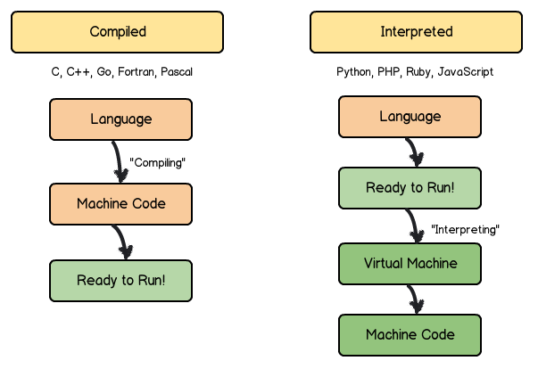

# Introduction to Programming
_Jump start: Lesson 5_

## Learning Goal
* Develop an understanding of how technologies are used in combination to create a web application

## Overview
Throughout this section of the Jumpstart program, you will learn a number of different topics about the Ruby programming language. In this lesson, we will discuss the different technologies that can be used along with Ruby and how those all play together in your journey in learning to program.

## Programming Languages
In a discussion about programming languages, a preliminary question that one might ask is, why are there so many programming languages? Some languages are better at certain things than others.

There are two main ways we can classify programming languages, by level and by compiled or interpreted.

### By level
How close the language is to being [binary code](https://en.wikipedia.org/wiki/Binary_code). Low-level languages like C, tend to be more difficult for humans to read than other languages. High-level languages like Java, Pythin, and Ruby tend to be more abstract, easier for humans to read, and do a lot more for the software developer.

### By compiled or interpretted
Compiled languages are converted to binary code (e.g., C, C++, Java). Interpreted languages can be translated or directly executed (e.g., Ruby, Python). The code does not get directly converted to binary, the program that runs the program is the one that communicates with the computer.

In Addition, these compiled and interpreted languages can be divided into _dynamically typed_ and _statically typed_ languages. Statically typed programming languages do type checking (the process of verifying and enforcing the constraints of types) at compile-time as opposed to run-time. Dynamically typed programming languages do type checking at run-time as opposed to compile-time.

### Ruby
Ruby is a high-level, dynamically typed language. Ruby is a programming language which was created to make developers have fun and be productive at the same time.

### HTML & CSS
HTML (Hyper-Text Markup Language) is a [markup language](https://en.wikipedia.org/wiki/Markup_language). CSS (Cascading Style Sheets) is a [stylesheet language](https://en.wikipedia.org/wiki/Style_sheet_language). These two technologies work together for structuring and styling the content on a web page.

You can think of the HTML as the "skeleton" of a web page. The set up, and structure for how each piece is organized. The CSS is the "clothes" of the skeleton. How each piece looks, colors, sizes, styles and relationship to other elements on the page.

### JavaScript
JavaScript is a dynamically typed and interpreted programming language. JavaScript is used along side HTML and CSS as one of the most important languages in web programming. In many applications, we use JavaScript to provide a more dynamic and responsive experience for the end user.

## Frameworks
Frameworks allow us to leverage the hard work of the software developers that came before us so that we can create software more quickly. Take some time to read [What is a Software Framework? And why should you like 'em?](http://info.cimetrix.com/blog/bid/22339/What-is-a-Software-Framework-And-why-should-you-like-em)

### Ruby on Rails
Ruby on Rails, or Rails for short, is a Model-View Controller (MVC) framework which provides the default database, web service and web pages. Ruby on Rails allows you, as a developer, to create an entire web application without having to rely on someone else to create part of it for you.

