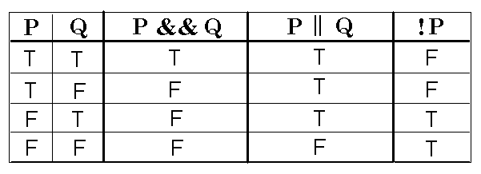
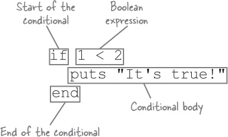

# Programming Expressions
_Jump start: Lesson 10_

## Learning goals
- Understand and be able to use relational operators
- Understand and be able to use truth tables for logical operators
- Understand and be able to use conditional statements
- Understand the control flow of a program

## Activities
* Review the notes in this section
* Complete the [practice problems](./practice-problems.md)
* Complete the [candy machine](./candy-machine.md) assignment

## Relational operators
* Relational operators allow you to compare two values
* In ruby you can use relational operators on all numbers and strings, additionally you can use equals and does not equal on arrays and hashes
* The opposite of `>` is `<=` and the opposite of `<` is `>=`
* `=` is the assignment operator, which is very different than `==` which is the equality operator
* The result of a relational operator is either `true` or `false`, also known as a boolean

| __Operator__ | __Description__ | __Example__ | __Result__ |
| :--- | :--- | :--- | :--- |
| `==` | equals | `1 + 1 == 2` | `true` |
| `!=` | does not equal | `3.2 != 2.5` | `true` |
| `<` | less than | `10 < 5` | `false` |
| `>` | greater than | `10 > 5` | `true` |
| `<=` | less than or equal to | `126 <= 100` | `false` |
| `>=` | greater than or equal to | `5.0 >= 5.0` | `true` |

### Boolean values
* The two possible values of a boolean data type are `true` and `false`
* A non-boolean value that evaluates to true, is called "truthy"
  * Everything in ruby is "truthy" except for `nil` 
* A non-boolean value that evaluates to false, is called "falsey", also sometimes "falsy"
  * `nil` is the only "falsey" value in ruby

## Logical operators
* Logical operators allow you to combine or modify boolean expressions

| __Operator__ | __Description__ | __Example__ | __Result__ |
| :--- | :--- | :--- | :--- |
| `&&` | and | `(2 == 3) && (-1 < 5)` | `false`|
| `||` | or | `(2 == 3) || (-1 < 5)` | `true` |
| `!` | not | `!(2 == 3)` | `true` |

| __p__ | __q__ | __p && q__ | __p &#124;&#124; q__ |
| :--- | :--- | :--- | :--- |
| `true` | `true` | `true` | `true` |
| `true` | `false` | `false` | `true` |
| `false` | `true` | `false` | `true` |
| `false` | `false` | `false` | `false` |

| __p__ | __!p__ |
| :--- | :--- |
| `true` | `false` |
| `false` | `true` |

### Truth tables


## Conditionals
Conditional statements allow your programs to take different paths based on different inputs. You have already seen some version of conditional statements if you have ever seen a [flow diagram](./images/flow-control.png).

To create conditional statements use `if`, `elsif`, and `else` to control the flow of a program. It is important to property indent conditional statements. Indentation is not required for a program to execute it is absolutely necessary to be able to correctly read your program.

### Syntax
```ruby
if <boolean expression>
  # conditional body
  # this code only executes if the <boolean expression> evaluates as true
end
```

```ruby
if <boolean expression>
  # conditional body
else
  # else body
end
```



### Examples
```ruby
test_score = gets.chomp.to_i

if test_score > 90
  print "You got an A!"
end
```

```ruby
test_score = gets.chomp.to_i

if test_score > 90
  print "You got an A!"
else
  print "You did not get an A!"
end
```

```ruby
puts "What is your favorite animal?"
fav_animal = gets.chomp

if fav_animal.downcase == "camel"
  puts "I also love camels!"
else
  puts "That's a great animal, but I love camels the most."
end

puts "Thanks for playing the favorite animal game!"
```

```ruby
puts "What is your favorite animal?"
fav_animal = gets.chomp.downcase

if fav_animal == "camel"
  puts "I also love camels!"
elsif fav_animal == "kangaroo"
  puts "The kangaroo is my second favorite animal!"
else
  puts "That's a great animal, but I love camels the most."
end

puts "Thanks for playing the favorite animal game!"
```
