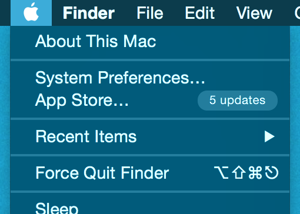

# Environment Setup

_JumpStart: Lesson 7_

## Learning Goals

* To setup a development environment
* Gain confidence in using interactive Ruby (`irb`)
* Gain confidence in using VS Code

## Activities

* Review notes
* Complete install fest
* (Optional) [Creating a gist from VS Code](gist-from-vscode.md)

## Notes

### Interactive Ruby

Interactive Ruby (`irb`) is a computer program that allows the user to enter Ruby code and get results of that code immediately. It is a feature known as a REPL(read, evaluate, print loop). These kinds of programs are great for trying out new commands, practicing syntax, and evaluating solutions to small problems. It's one of the two primary ways to use Ruby to interact with a computer. The other is to put Ruby code into a file and then ask the computer to read and execute the code in the file. We will do lots of both.

### Text Editors

A text editor is a computer program that allows you to create and edit files that contain plain text. This is different than a robust word processing program like Microsoft Word, or Google Docs. When you're writing computer code, you don't need or want any special formatting to be part of the file. In fact, your code probably won't work at all unless it was written and saved in a plain text environment.

Text editors are commonly used by web designers and developers because it provides maximum flexibility to create just about anything. A text editor is not the same thing as an integrated development environment(IDE). While almost every IDE has the capability of creating and editing plain text documents, they also include a wealth of other features and powerful capabilities.

As the installfest below illustrates, we use [Visual Studio Code](https://code.visualstudio.com/) as our official text editor at Ada.  In the future all projects will be written in VS Code while you can use IRB to experiment with short snippets of code.  

**NOTE** VS Code has a terminal screen.  We ask you **not** to use it.  Instead maintain a separate terminal window when you write code at Ada.  It will help with your workflow.  

## Installfest

### Installing Homebrew, Ruby, VS Code & Git

In the Ada Textbook curriculum we have an [installfest](https://github.com/Ada-Developers-Academy/textbook-curriculum/blob/master/00-programming-fundamentals/installfest.md) prepared which will walk you through installing all the software required to start at Ada.

#### _macOS High Sierra_, _macOS Sierra_, or _OS X El Capitan_

_macOS_ (previously called _OS X_ and _Mac OS X_) is the name of the operating system found on Apple computers. Apple likes to give the versions of their operating systems odd names. They used to be big cats (Cheetah, Puma, Jaguar, Panther, Tiger, Leopard, Snow Leopard, Lion, and Mountain Lion). Now it's... I don't even know. Anyway, the three most recent versions are _macOS Mojave_, _macOS High Sierra_, and _macOS Sierra_. For Ada, your computer must be running one of these versions of macOS/OS X, with preference given to _Mojave_.

To check your version of macOS/OS X, click the Apple icon at the far left edge of toolbar at the top of the screen. From there, choose _About This Mac_. That'll open a window with lots and lots of information about your computer. Right at the top, in big type, is the current version of macOS/OS X.

If your Mac isn't running _Mojave_, _High Sierra_, or _Sierra_, please use the App Store to update. You can open the desktop App Store by going back to the Apple menu and selecting __App Store...__. Operating System upgrades are free, and [Apple's got a detailed guide on updating](http://www.apple.com/osx/how-to-upgrade/).

#### Google Chrome

We will use the Chrome web browser by Google in class, because it provides more developer tools for us to use.

##### Google Chrome installation steps

* Download [Chrome](https://www.google.com/chrome/browser/desktop/index.html) to your Applications folder
* Open the downloaded application package and follow the instructions
* Drag Chrome to your dock

##### References

* [A Convincing Case for Visual Studio Code](https://blog.bitsrc.io/a-convincing-case-for-visual-studio-code-c5bcc18e1693)