_Jumpstart_

# Environment Setup
## Creating a Gist Directly From VS Code
_This lesson is optional. It walks you through how to create a `gist` directly from `VS Code`._

### Part 1 Install Gist Extension

First we'll install an extension which can let us post code samples to github.

1. In `VS Code` type command-shift-x (⌘⇧x).  This will allow you to install extensions to `VS Code`.
2. Search for `gist` and install the `gist` extension

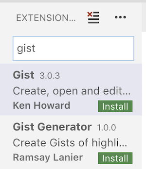

3. On the left hand-side, click `Install`

### Part 2 Configure Gist Extension

Next we need to create a special token in Github to allow VS Code to post gists in our name.

1. Go to github and [generate a new token](https://github.com/settings/tokens/new)
2. Login to Github
3. Type `gist` in the `Token Description` text box, check the `gist` box, and scroll down and click `Generate token`
Name the token:
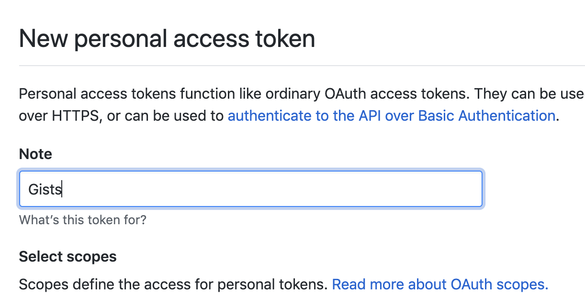
Check the 'gist' checkbox
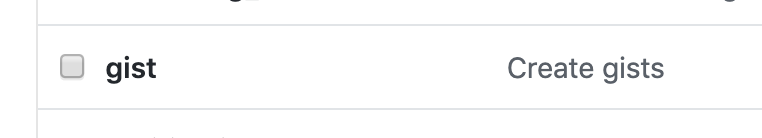

4. Copy the generated token

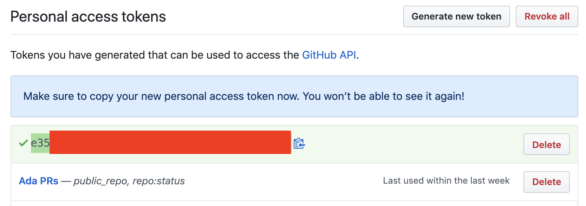

5. Then in `VS Code` press `F1` and type `select profile` and select the option.

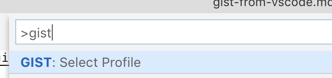

6. Pick `Github.com (common`)

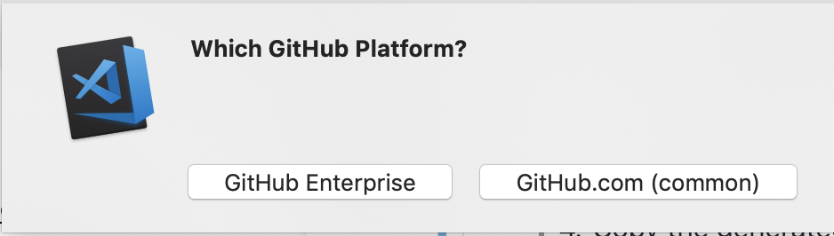

7.  Paste in your github token and name the profile.

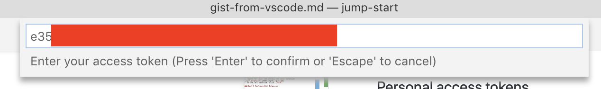
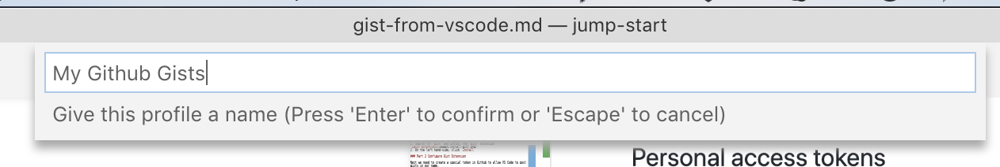

### Part 3 Create a Gist

Now we will create a Gist online.

1. Go back to `VS Code` and select a file you want to publish as a gist.  

2. Then press `F1` and select `create new gist`

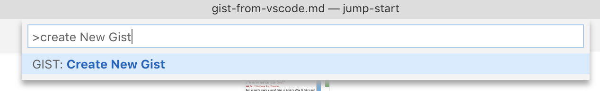

3. Next name your gist

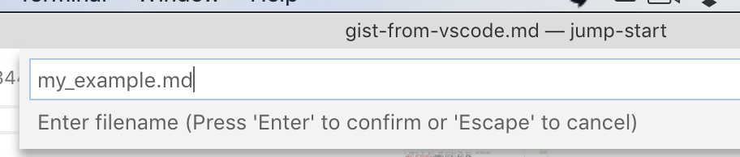

4. Then give it a description (blank is fine).

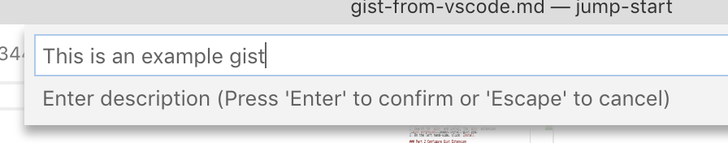

5.  You can make it public or not

6.  Then you can open the gist in the browser

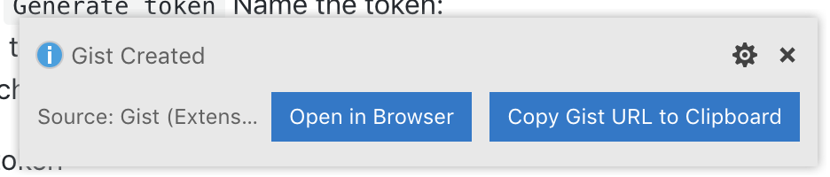

## References

This VS Code extension was created by [Ken Howard](https://github.com/kenhowardpdx), you can find more information about it in the [vscode-gist repository](https://github.com/kenhowardpdx/vscode-gist)
