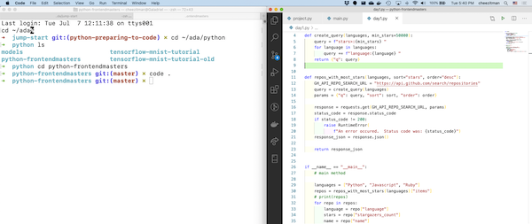

# macOS Keyboard navigation

_JumpStart: Lesson 4_

_Note: You can postpone this lesson until you have a Mac computer_

## Learning Goals

* Become familiar with navigating the macOS environment
* Understand why and how to utilize multiple tabs, application windows, and desktops
* Start using application shortcuts and hotkeys
* Effectively find applications, folders, and files
* Effectively manage open applications

## Overview

Most software developers rely heavily on their keyboards and less so on their pointing devices (e.g., mouse, trackpad). This lesson will help you get comfortable using your keyboard to navigate in macOS.

## Common macOS shortcuts

Fill in the table below with the matching macOS shortcuts, if you don't know them use an internet search to find them.

| What the command does           | Mac shortcut |
| :------------------------------ | :----------- |
| Copy                            |              |
| Paste                           |              |
| Cut                             |              |
| Save                            |              |
| Select                          |              |
| Undo                            |              |
| Redo                            |              |
| Find                            |              |
| Switch app                      |              |
| Open spotlight search           |              |
| Force quit                      |              |
| Full-screen screen shot         |              |
| User-defined region screen shot |              |

## macOS Overview

| Interface component | Overview                                                                                                                                                                                                                                                                                                                                           |
| :------------------ | :------------------------------------------------------------------------------------------------------------------------------------------------------------------------------------------------------------------------------------------------------------------------------------------------------------------------------------------------- |
| Dock                | The Dock is the strip of apps at the bottom of the screen. You can change its size and location by going to Preference > Dock. Spend some time determining the best size and location for you. You can add applications to your dock by dragging them onto it, and you can expose options for applications in your dock by right-clicking on them. |
| Finder              | Finder is an application that lets you visually navigate your files and folders.                                                                                                                                                                                                                                                                   |
| Menu bar            | The Menu bar at the top of macOS is context sensitive, and will change based on the application you have in focus.                                                                                                                                                                                                                                 |
| Mission control     | Allows you to see all your open apps at once, there are many ways to launch this application, search the internet for the one that works best for you.                                                                                                                                                                                             |
| Mouse & Trackpad    | Spend some time in your system preferences customizing these to your work style.                                                                                                                                                                                                                                                                   |
## Learning the Menu Symbols

Whenever you open a menu, it will use these symbols to show you which keyboard shortcuts you can use to run the menu option at hand. It can be quite helpful to make a set of flashcards to remember these. I thought they were really _weird_ at first, and flashcards were a quick and easy method for me to test whether I'd learned the symbols correctly.

| Button    | Mac Symbol | How To Remember It                                                                                      |
| --------- | :--------: | ------------------------------------------------------------------------------------------------------- |
| Command   |     ⌘      | Ah, here's where I left those four robots I can command to open menus / do other computer stuff for me. |
| Option    |     ⌥      | Sliding down a bookcase lined with options & picking the first one that looks good.                     |
| Control   |     ⌃      | The magic button I need to press to gain control of a robot.                                            |
| Shift     |     ⇧      | Hey, you short lowercase letter, come up here!                                                          |
| Caps Lock |     ⇪      | And stay up! Here's a box to help. You can stand on it. :)                                              |

## Common Hotkeys that will save your life

### Text Editing Keyboard Combinations

Below are a series of keyboard shortcuts that will help you in a text-editor writing code.

| Hot Key Combo                                        |         Mac Symbols         | What It Does                                                 |
| ---------------------------------------------------- | :-------------------------: | ------------------------------------------------------------ |
| <kbd>Command</kbd> + <kbd>s</kbd>                    |           `⌘ + s`           | Save code in the text editor!  **Do this a lot!**            |
| <kbd>Command</kbd> + <kbd>c</kbd>                    |           `⌘ + c`           | Copy the text currently highlighted (ctrl-c in windows).     |
| <kbd>Command</kbd> + <kbd>x</kbd>                    |           `⌘ + x`           | Remove the text highlighted and save it in the clipboard.    |
| <kbd>Command</kbd> + <kbd>v</kbd>                    |           `⌘ + v`           | Paste last copied content from clipboard.                    |
| <kbd>Command</kbd> + <kbd>z</kbd>                    |           `⌘ + z`           | Undo the last action (repeat to undo multiple things).       |
| <kbd>Command</kbd> + <kbd>shift</kbd> + <kbd>z</kbd> |         `⌘ + ⇧ + z`         | Redo the last undo.                                          |
| <kbd>Command</kbd> + <kbd>a</kbd>                    |           `⌘ + a`           | Select everything in the window.                             |
| <kbd>Command<kbd> + <kbd>l</kbd>                     |           `⌘ + l`           | Select the current line.                                     |
| <kbd>Command</kbd> + any arrow key                   |      `⌘ + <any arrow>`      | Move the cursor to the maximum point in the given direction. |
| <kbd>Option</kbd> left or right arrow key            | `⌥ + <left or right arrow>` | Move the cursor one word in either direction                 |
| <kbd>Shift</kbd> + any arrow key                     |      `⇧ + <any arrow>`      | Highlight from the start and  end of the cursor              |

### System Navigation

These keyboard shortcuts work with a variety of applications to let you navigate within an application or between applications.

| Hot Key Combo          | Mac Symbols | What it does                                                                                                                                                                              |
| ---------------------- | :---------: | ----------------------------------------------------------------------------------------------------------------------------------------------------------------------------------------- |
| cmd-w                  |   `⌘ + w`   | Close the Current tab.                                                                                                                                                                    |
| cmd-shift-w            | `⌘ + ⇧ + w` | Close the Current window (all the tabs).                                                                                                                                                  |
| cmd-q                  |   `⌘ + q`   | Quit the application (`⌘⇧w` keeps the application running).                                                                                                                               |
| cmd-tab                |   `⌘ + ⇥`   | Switch between applications.  Continue to hold the `⌘` button to display all open programs each tap on `⇥` will switch to the next app.  You can use `⌘⇧⇥` to switch to the previous app. |
| cmd-backtick           | `` ⌘ + ` `` | Switch between windows in the same application.                                                                                                                                           |
| cmd-Space              |   `⌘ + ␣`   | Turn on spotlight.  Spotlight lets you search applications, files and do basic functions like math & conversions.                                                                         |
| cmd-Shift-leftbracket  | `⌘ + ⇧ + [` | Move one tab to the left.                                                                                                                                                                 |
| cmd-Shift-rightbracket | `⌘ + ⇧ + ]` | Move one tab to the right.                                                                                                                                                                |
| cmd-Shift-t            | `⌘ + ⇧ + t` | open the last closed item.                                                                                                                                                                |
| cmd-f                  |   `⌘ + f`   | Find.  Opens a panel to search for a term.                                                                                                                                                |
| cmd-shift-f            | `⌘ + ⇧ + f` | Find all.  Searches all files (text editors like VS Code & Atom only).                                                                                                                    |
| cmd-n                  |   `⌘ + n`   | Opens a new window (or file depending on the application).                                                                                                                                |
| cmd-t                  |   `⌘ + t`   | Opens a new tab in a browser                                                                                                                                                              |
| cmd-r                  |   `⌘ + r`   | Reloads the page in a browser                                                                                                                                                             |
| cmd-comma              |   `⌘ + ,`   | Opens an app's preferences page.                                                                                                                                                          |
| cmd-/                  |   `⌘ + /`   | Make either the current line or a selection of text a comment (text editors like VS Code & Atom only)                                                                                     |
| ctrl-cmd-f             | `^ + ⌘ + f` | Fullscreen                                                                                                                                                                                |

## A Word About Mice

Steve Jobs had a [weird thing](http://www.cultofmac.com/269222/steve-jobs-hated-idea-multi-button-mouse-designer-claims/) about single-button mice. Right-click is disabled on macs by default, but you can turn it on via the following steps:

1. Use spotlight to open up `System Preferences`
1. Click on `Trackpad`
1. Click on the `Point and Click` tab
1. Check the box next to `Secondary click`

You can also [two-finger click](https://www.howtogeek.com/218715/how-to-right-click-with-two-fingers-and-other-os-x-trackpad-gestures/) or [ctrl-click](https://www.wikihow.com/Right-Click-on-a-Mac). 

## Practice tasks

Try to perform these tasks on the Mac, to learn how to navigate the operating system.

1. Use Spotlight to open the finder
    * What does tab do in finder?
    * What does shift + tab do in finder?
1. Do the following commands using only the keyboard:
    1. Open your web browser
    1. Navigate to adadevelopersacademy.org
    1. Keeping the Ada browser tab open, open a new tab
    1. Navigate to google.com
    1. Navigate back to the Ada tab
    1. Refresh the web page
    1. Quit out of the web browser (don't just close the tabs, close the whole application)
1. Use Spotlight to open Finder, web browser, system preferences and then switch between all three applications

## Split Screen

When you write code on a laptop, it is often important to be able to see documentation and code side-by-side. The latest version of Mac OS allows you to do this without any additional apps. Apps like [Rectangle](https://rectangleapp.com/) will give you even more control over this, if desired.

1. Click and hold on the green maximize icon in the upper left corner of an app until it responds (by shrinking)
1. Drag the window to one side of your screen
1. Choose the second app from your open apps to display on the other side of the screen

There are a number of other ways to accomplish this same behavior, so be sure to play around with this. **It will be necessary**, so if it's challenging now, just keep practicing!

## Taking Screenshots

As of macOS Mojave there is a handy Screenshot.app that you can run in your Applications folder.  (It's inside Utilities.)  

### Screenshot Keyboard Shotcuts

Screenshots on a Mac are very cool. By default, they save a file to the desktop. If you add Control (⌃) to the shortcut, the screenshot will be copied to the clipboard instead.

| Behavior / PC Key                                         | Mac Keyboard Shortcut                           | In Symbols!                        |
| --------------------------------------------------------- | ----------------------------------------------- | ---------------------------------- |
| Print Screen (full screen, saved to desktop)              | Command + Shift + 3                             | ⌘⇧3 (⌘#)                           |
| Print Screen (full screen, copied to clipboard)           | Control + Command + Shift + 3                   | ⌃⌘⇧3 (⌃⌘#)                         |
| Print Screen (select area, saved to desktop)              | Command + Shift + 4                             | ⌘⇧4 (⌘$)                           |
| Print Screen (select area, copied to clipboard)           | Control + Command + Shift + 4                   | ⌃⌘⇧4 (⌃⌘$)                         |
| Print Screen (application window, PC: Alt + Print Screen) | Command + Shift + 4, Space-bar, Click on Window | ⌘⇧4 (⌘$), {Space}, Click on Window |

## Resources

* [MacWorld How to go from PC to Mac](https://www.macworld.co.uk/how-to/mac/how-move-from-pc-mac-3620931/)
* [Youtube - Mac Tutorial for Beginners](https://www.youtube.com/watch?v=67keaaWOKzE)
